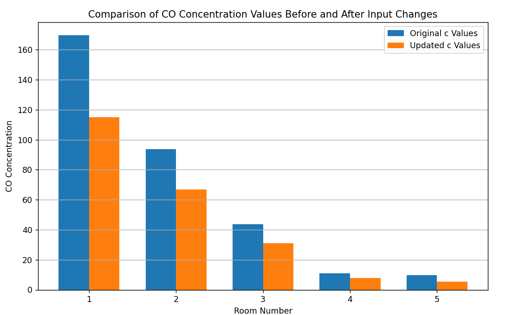

# Carbon-Oxide-Concentration-Problem
A solution to the problem regarding CO concentration in different rooms considering different sources and their changes

## Overview

The code models a scenario where CO is introduced into a system of rooms from external sources like smoking and a grill, and is distributed between rooms through air exchange. The goal is to determine the concentration of CO in each room and analyze the impact of changes in CO sources.
  
  

LU decomposition has been used to speed up the process of matrix calculation and invertion. This simplifies the process of calculating bigger scale matrixes and makes it less power consuming.
## Features

- Calculation of CO concentrations in each room using LU decomposition.
- Visualization of matrix representations for the system of equations and the solution vector.
- Analysis of the percentage contribution of each CO source to the total CO concentration in a specific room (children's room).
- Comparison of CO concentrations before and after reducing the emission from external sources.

## Usage

The output of the script includes:

- The inverse of matrix A representing the system of equations.
- CO concentration values in each room before and after changes in external CO sources.
- Visual representation of the matrices and concentration levels as both heatmaps and bar graphs.

## Task Conditions

The analysis is based on the following conditions:
- Room-to-room air exchange rates (E_ij) in m^3/h.
- External CO sources and their rates in mg/h.
- Ventilation rates for each room in m^3/h.

These conditions can be modified in the code to analyze different scenarios.

## Examples

Here is an example on script's output under given starting state:

Output data in steady-state:

Output A, c and b matrixes before and after changes in environment:

A graph showing the change in CO concentration before and after changes in environment:

